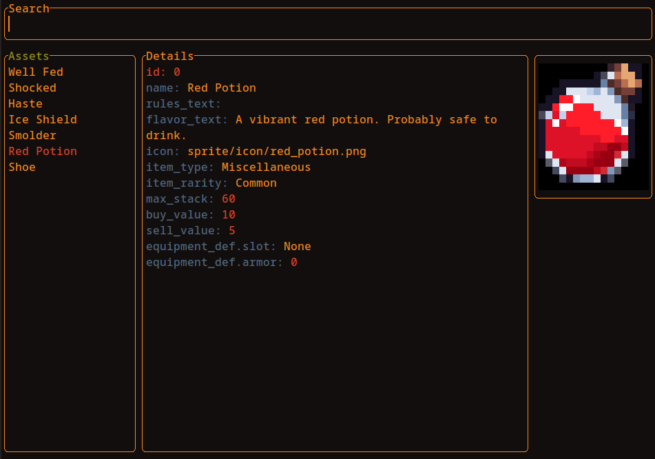

A TUI asset editor used to create and modify assets for games written in Rust. In the context of this tool, "assets" refers to your typical game objects, like items, abilities and characters.



[Click here to see a short demo](https://www.youtube.com/watch?v=EBW31fYh9h8)

## Overview
This tool is incomplete, buggy, and generally follows *worst* practices. Use this code at your own risk! A separate, more bespoke version of this tool is being developed alongside [aark:net](https://www.youtube.com/@yaadayaada), which is a 3D Action RPG that I'm developing using Godot + Rust. I don't intend to regularly update this repo, nor accept pull requests, but might release a more complete, generic version in the future.

This tool requires that you use a terminal emulator that allows you to set arbitrary foreground and background colors for each cell, and key presses involving modifier keys, both of which are not features present in all terminals. You are likely to have the most luck using [Alacritty](https://alacritty.org/) which is the terminal emulator I am developing this tool on. [Kitty](https://sw.kovidgoyal.net/kitty/) should also work.

The tool also has a system in place to make it easy to add additional tools, represented as different `Window`s. Try adding your own!

## Running the Asset Editor
```
git clone git@github.com:YaadaYaada/tui-asset-editor.git
cargo run
```

## Controls

```
ESC -> Exit Window
Enter -> Select Window or Edit Field
Tab -> Cycle Subwindows
Arrow Keys -> Navigate Within Subwindows
Shift Arrow Keys (Up and Down) -> Change selected detail field
```
